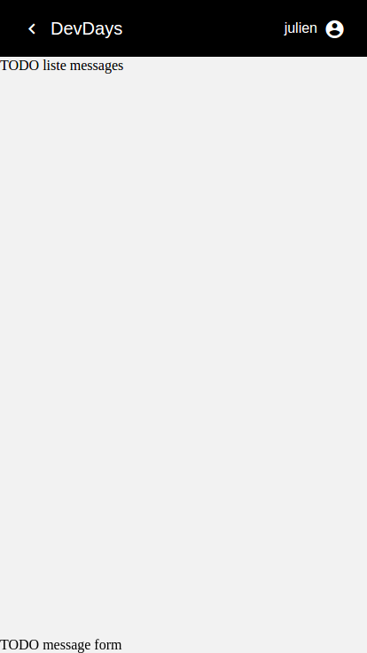

# DevdaysChat

## STEP 01

### créer chat component
- cd src/app
- ng g component chat
- class
    - init constructor : s1-chat
- template
    - init template : s1-chat
    - init css : s1-container

<<<<<<< HEAD
### router
- add route dans app.routes : s1-route
- add routerLink dans rooms.component.html : [routerLink]="['/rooms', room.$key, 'chat']"
=======

### router
1. app.routes.ts
- add route dans app.routes

```typescript
import { ChatComponent } from './chat/chat.component';
const appRoutes: Routes = [
  ...,
  {
    path: 'rooms/:roomId/chat',
    component: ChatComponent
  }
];
```

2. rooms.component.html
- add routerLink dans rooms.component.html : [routerLink]="['/rooms', room.$key, 'chat']"

```html
  <button md-mini-fab color="primary" [routerLink]="['/rooms', room.$key, 'chat']" (click)="selectRoom(room)">
    <md-icon class="md-24">comment</md-icon>
  </button>
```


### chat component 

1. chat.component.html

```html
<section class="container">

  <div>TODO liste messages</div>

  <div class="fixed">

    <div>TODO message form</div>

  </div>

</section>
```

2. chat.component.css

```css
.container {
  background-color: #f2f2f2;
  display: flex;
  min-height: 100vh;
  flex-direction: column;
}
.fixed {
  position: fixed;
  bottom: 0;
  left: 0;
  right: 0;
}
```


# RESULT

>>>>>>> e99709b... strep 01 docs
