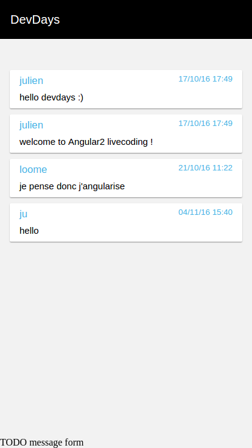

# DevdaysChat

## STEP 02

Objectifs :

1. créer le service pour récupérer les messages depuis Firebase
2. créer le composant `messages.component` pour afficher cette liste de message
3. récupérer roomId dans `chat.component` pour le transmettre à `messages.component`

### ChatMessageService

- cd src/app/shared/services
- ng g service chatMessages

1. `chat-messages.service.ts`

```typescript
import { ChatMessage } from '../models/chat-message';
import { AngularFire } from 'angularfire2';
import { Injectable } from '@angular/core';
import { Observable } from 'rxjs/Observable';

@Injectable()
export class ChatMessagesService {

  // injection du service pour appeler Firebase
  constructor(private _af: AngularFire) { }

  getMessagesByRoomId(roomId: string): Observable<ChatMessage[]> {
    // - appel via API à la liste des messages de la room
    // - on limite aux 50 derniers messages (voir API options query)
    return this._af.database.list(`rooms/${roomId}/messages`, {
      query: {
        limitToLast: 50
      }
    });
  }

}
``` 

2. `src/app/shared/services/index.ts`

```typescript
export * from './chat-messages.service'; // add service
export * from './user.service';
export * from './auth.service';
export * from './auth-guard.service';
export * from './room.service';
```

3. `app.module.ts`
- ajout du service dans les providers

```typescript
// services
import { UserService, AuthService, RoomService, ChatMessagesService } from './shared/services';

@NgModule({
  ...
  providers: [ appRoutingProviders, UserService, AuthService, RoomService, ChatMessagesService ],
  ...
})
export class AppModule { }
``` 


### messages component

- cd src/app/chat
- ng g component messages

1. `messages.component.ts` :

```typescript
import { ChatMessage } from '../../shared/models/chat-message';
import { Component, OnInit, Input } from '@angular/core';
import { ChatMessagesService } from '../../shared/services';
import { Observable } from 'rxjs/Observable';

@Component({
  selector: 'ddo-messages',
  templateUrl: './messages.component.html',
  styleUrls: ['./messages.component.css']
})
export class MessagesComponent implements OnInit {

  // param roomId en entrée du composant
  @Input() roomId: string;

  // property interne du composant
  // Observable d'un array de ChatMessage 
  messages: Observable<ChatMessage[]>;

  // injection du service ChatMessages
  constructor(private chatMessagesService: ChatMessagesService) { }

  ngOnInit() {
    // à l'init : appel, via service, à Firebase pour récupérer la liste des messages de la room 
    this.messages = this.chatMessagesService.getMessagesByRoomId(this.roomId);
  }
 
}
```

2. `messages.component.html`

```html
<section class="message-list-container">
  <!-- 
   - boucle sur la liste des messages
   - utilisation de ' | async ' car messages est un Observable
   - ce pipe permet d'executer un 'subscribe'
   -->
  <div *ngFor="let message of messages | async">
    <md-card>
      <md-card-title>
        <div>
          <span class="message-author"><small>{{ message.author }}</small></span>
          <span class="message-date"><small>{{ message.created | date:'dd/MM/yy HH:mm' }}</small></span>
        </div>
      </md-card-title>
      <md-card-content>{{ message.body}}</md-card-content>
    </md-card>
  </div>
</section>
```

3. `messages.component.css`

```css
.message-list-container {
  margin: 50px 16px 115px 16px;
}

md-spinner {
  margin:auto;
}

md-card {
  margin-bottom: 10px;
  padding-top: 5px;
  padding-bottom: 10px;
}

md-card.my-message .message-author, 
md-card.my-message .message-date {
  color: #ff6600;
}

md-card-title {
  font-size:20px;
  margin-bottom: 8px;
}

md-card-content {
  font-size:15px;
}

.message-date {
  float:right;
  font-size: medium;
}

.message-author, .message-date {
  color: #4BB4E6;
}
```

### chat component

1. `chat.component.html`

```html
<section class="container">

  <!-- ADD component liste des messages -->
  <ddo-messages [roomId]="roomId" ></ddo-messages>

  <div class="fixed">

    <div>TODO message form</div>

  </div>

</section>
```

2. `chat.component.ts`

```typescript
import { ActivatedRoute } from '@angular/router';
import { Component, OnInit } from '@angular/core';

@Component({
  selector: 'ddo-chat',
  templateUrl: './chat.component.html',
  styleUrls: ['./chat.component.css']
})
export class ChatComponent implements OnInit {

  roomId: string;

  constructor(private route: ActivatedRoute) { }

  ngOnInit() {
    this.roomId = this.route.snapshot.params['roomId'];
  }

}
```

# RESULT
