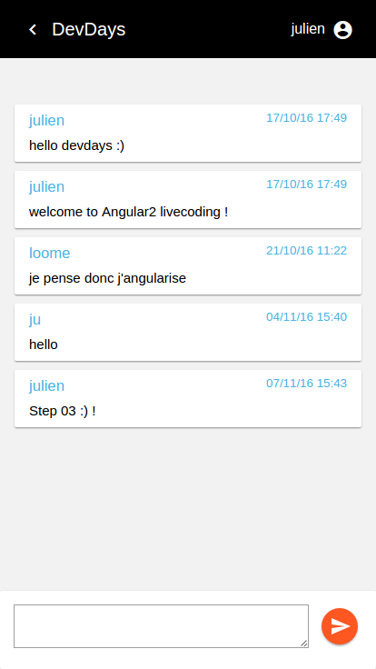

# DevdaysChat

## STEP 03

Objectif : créer le composant pour envoyer un message à Firebase 

1. enrichir ChatMessagesService pour envoyer un message à Firebase  
2. créer le composant `message-form.component` pour saisir et envoyer le message

### ChatMessageService

`chat-messages.service.ts`

```typescript
import { ChatMessage } from '../models/chat-message';
import { AngularFire } from 'angularfire2';
import { Injectable } from '@angular/core';
import { Observable } from 'rxjs/Observable';

@Injectable()
export class ChatMessagesService {

  // injection du service pour appeler Firebase
  constructor(private _af: AngularFire) { }

  getMessagesByRoomId(roomId: string): Observable<ChatMessage[]> {
    // - appel via API à la liste des messages de la room
    // - on limite aux 50 derniers messages (voir API options query)
    return this._af.database.list(`rooms/${roomId}/messages`, {
      query: {
        limitToLast: 50
      }
    });
  }

  createMessage(roomId: string, newMessage: ChatMessage): Promise<void> {
    return new Promise((resolve) => {
      this._af.database.list(`rooms/${roomId}/messages`)
                       .push(newMessage)
                       .then(() => resolve());
    });
  }

}
``` 


### message-form

- cd src/app/chat
- ng g component messageForm

1. `message-form.component.ts`
```typescript
import { ChatMessage } from '../../shared/models/chat-message';
import { Component, OnInit, Input } from '@angular/core';
import { ChatMessagesService, UserService } from '../../shared/services';

// internal class to form model
class ChatMessageFormModel implements ChatMessage {
  author: string;
  body: string;
  created?: string;
}

@Component({
  selector: 'ddo-message-form',
  templateUrl: './message-form.component.html',
  styleUrls: ['./message-form.component.css']
})
export class MessageFormComponent implements OnInit {

  // input property
  @Input() roomId: string;

  // initialize message model (with constructor)
  message: ChatMessageFormModel = new ChatMessageFormModel();

  // inject services
  constructor(private chatMessagesService: ChatMessagesService,
              private userService: UserService) { }

  ngOnInit() {
    // init author message -> user connected
    this.message.author = this.userService.getUser().pseudo;
  }

  saveMessage() {
    // init date to send message
    this.message.created = new Date().toUTCString();
    // call service to send message
    this.chatMessagesService.createMessage(this.roomId, this.message)
                            .then(() => this.message.body = '');
  }

}

```

2. `message-form.component.html`

```html
<md-card>
  <md-card-content>
    <form (ngSubmit)="saveMessage()" >
      <textarea [(ngModel)]="message.body" name="body" ></textarea>
      <button md-mini-fab color="primary" type="submit">
          <md-icon class="md-24">send</md-icon>
      </button>
    </form>
  </md-card-content>
</md-card>
```


3. `message-form.component.css`

```css
md-card {
    padding: 15px;
}

textarea {
  width: 83%;
  border: 1px #9e9e9e solid;
  resize: vertical;
  font-family: Roboto, "Helvetica Neue", sans-serif;
  font-size: 18px;
}

div {
  width:100%;
  text-align:right;
}

button {
  padding-left:3px;
  top: -12px;
  left: 10px;
}
```


### chat component

1. `chat.component.html`

```html
<section class="container">

  <ddo-messages [roomId]="roomId" ></ddo-messages>

  <div class="fixed">

    <ddo-message-form [roomId]="roomId" ></ddo-message-form>

  </div>

</section>
```


# RESULT

