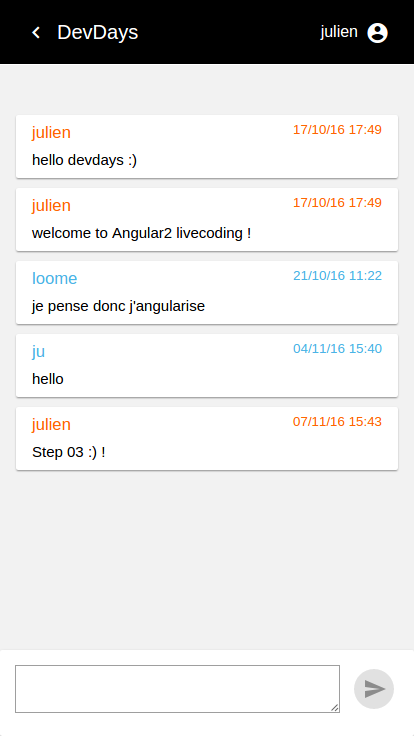

# DevdaysChat

## STEP 04

Objectif : vadidation & feature 


1. validation du formulaire  
2. identifier l'auteur du message

### message-form

1. `message-form.component.html`

```html
<md-card>

  <md-card-content>
    
    <!-- nommer le formulaire : msgForm --> 
    <form (ngSubmit)="saveMessage()" #msgForm="ngForm" >
      
      <!-- champ de saisie obligatoire : required --> 
      <textarea [(ngModel)]="message.body" name="body" required ></textarea>
      
      <!-- bouton 'send' actif si formulaire 'valide' -->
      <button md-mini-fab color="primary" type="submit" [disabled]="!msgForm.form.valid">
          <md-icon class="md-24">send</md-icon>
      </button>

    </form>

  </md-card-content>

</md-card>
```

### messages

1. `messages.component.ts`

```typescript
import { ChatMessage } from '../../shared/models/chat-message';
import { Component, OnInit, Input } from '@angular/core';
import { ChatMessagesService, UserService } from '../../shared/services';
import { Observable } from 'rxjs/Observable';

@Component({
  selector: 'ddo-messages',
  templateUrl: './messages.component.html',
  styleUrls: ['./messages.component.css']
})
export class MessagesComponent implements OnInit {

  @Input() roomId: string;
  messages: Observable<ChatMessage[]>;

  constructor(private chatMessagesService: ChatMessagesService, private userService: UserService) { }

  ngOnInit() {
    this.messages = this.chatMessagesService.getMessagesByRoomId(this.roomId);
  }

  isMyMessage(message: ChatMessage): boolean {
    return message.author === this.userService.getUser().pseudo;
  }
}
```

2. message-form.component.html

```html
<section class="message-list-container">
  <div *ngFor="let message of messages | async" >
    <!-- ajout class css si le message appartient au user connecté -->
    <md-card  [ngClass]="{ 'my-message' : isMyMessage(message) }">
      <md-card-title>
        <div>
          <span class="message-author"><small>{{ message.author }}</small></span>
          <span class="message-date"><small>{{ message.created | date:'dd/MM/yy HH:mm' }}</small></span>
        </div>
      </md-card-title>
      <md-card-content>{{ message.body}}</md-card-content>
    </md-card>
  </div>
</section>
```

# RESULT

